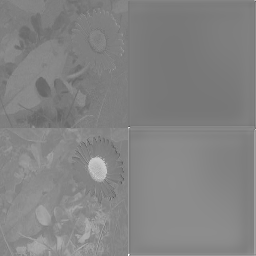

# On the Use of Pooling in Autoencoders

In the following I present results that I have obtained dealing with autoencoders.
The task I have chosen was regression, in particular regression for color channels in image colorization.

## Autoencoders for Image Colorization

In recent years, neural networks have made progress in the colorization of black and white images.
A common approach is to use an autoencoder, consisting of an encoder network that reduces the input to some neural
code (e.g. feature maps or a vector) that usually is smaller than the original input and a decoder network that 
reconstructs the target based on the neural code.
By forcing information to pass through the bottleneck, one can hope that only relevant information is passed between
the encoder and decoder networks and noise gets cancelled out.
Therefore autoencoders can result in models, that generalize well.

## Motivation

The question I am intrigued about is, how does narrowing the autoencoders bottleneck affect the models output and 
accuracy.
As the task at hand is image colorization, the bottleneck could be regarded as the size of the last feature maps,
handed from the encoder to the decoder network.
To gain some knowledge on the affects of an autoencoders bottleneck, I have considered variations of CNNs, as
discussed in the following.

## Model Configurations 

With the residing code, I have evaluated different configurations of a CNN autoencoder for image colorization.
In particular, I have considered up too 3 pooling and upsampling layers in my models, reducing the feature map size
and therefore tightening the bottleneck with each pooling operation.
All models were constructed with regression in mind, hence the HardTanh output layer, rather than a sigmoid.
Also Batch-Normalization was applied after each Convolution- and Transposed Convolution Layer.

### Starting With No Pooling:

Given a 128 by 128 pixel image, this model has a bottleneck of 128 by 128 feature maps with a total of 
2,097,152 values handed to the decoder network.

### One Pooling and Upsampling Layer:

Given a 128 by 128 pixel image, this model has a bottleneck of 64 by 64 feature maps, with a total of
1,048,576 values handed to the decoder network.

### Two Pooling and Upsampling Layers:

Given a 128 by 128 pixel image, this model has a bottleneck of 32 by 32 feature maps, with a total of 
524,288 values handed to the decoder network.

### Three Pooling and Upsampling Layers:

Given a 128 by 128 pixel image, this model has a bottleneck of 16 by 16 feature maps with a total of
262,144 values handed to the decoder network.

## Data

The task of image colorization was carried out on 769 images of daisies, obtained from 
[kaggle](https://www.kaggle.com/alxmamaev/flowers-recognition).
As image representation, I have chosen the CIE Lab color space, that encodes images in 3 channels.
The L channel is used for lightness, the a channel for differentiation between green and red and the b channel for 
differentiation between blue and yellow.

## Training

All models were trained with a batch size of 16 on a test split containing 576 Images.
The L1 loss, i.e. mean of pairwise absolute differences between the colour channels, was used as loss during training.
Adam was chosen as the method for optimization steps.

All models were trained for 100000 iterations, the progress is visualized in the following plots.
Additional to the L1 loss over time (/ steps), a sample image and its prediction is depicted.
The top row contains the original colour image, as well as its a and b channels, the bottom row the predicted 
colour image, as well as corresponding a and b channels.

### 0-Pooling Model

### 1-Pooling Model

### 2-Pooling Model

### 3-Pooling Model

## Evaluation

Evaluation was carried out on a test split, containing 193 images.
For evaluation I have considered upper bounds on the pairwise absolute distances of respective a and b channels.
The accuracy is defined by the mean percentage of channel values, that have a smaller absolute difference to their true
counterparts than the respective upper bound.

The results show that while the model with 3 pooling layers does well on small upper bounds, it also does worse on larger 
upper bounds.
Vice versa for the model with no pooling layers. 
A possible explanation could be, that the model with no pooling layers focuses on details, i.e. high frequencies in the
image, whereas the model with 3 pooling layers fits the mean of subareas in the image, due to the reduction to 16 by 16
feature maps at the bottle neck.
The model with 1 pooling layer seems to perform well across all upper bounds, compared to the other models.
The model with 2 pooling layers seems to perform worst.

Taking a look at some sample images, we can see that indeed, increasing the number of pooling and upsampling operations
results in the model outputting the mean of subareas.
Details vanish with increased pooling.

The following images have the original image on the left, the L channel in the middle and the models prediction, based 
on the L channel on the right.
The follow up images depict the true a and b channels on the left and predicted a and b channels on the right.

|0-Pooling Model                       | 1-Pooling Model                        | 2-Pooling Model                      | 3-Pooling Model                      |
|---------------------------------------|---------------------------------------|--------------------------------------|--------------------------------------|
| | |||
| | |||
| | |||
| | |||
| | |||
| | |||
| | |||
| | |||

Regarding colorization, it seems the model is biased towards green colours (looking at the first three sample images).
Also, the model has not fully learned which parts to colour white or yellow.
A possible explanation to this could be the distribution of colours in the training data.
The most present colour in the dataset is green, as the dataset mostly consists of flowers on grass.
As for the differentiation between white and yellow, both colours have similar lightness
(e.g. looking at the last sample image), to effectively recolorize these image parts, additional information, such as e.g.
object shapes and likelihoods of colours by shapes, may be needed to factor into the model.

Finally applying the models to an out of context image shows that the decoder is not biased towards reconstructing 
flower shapes, as demonstrated by applying the models to a picture of myself.
Objects/ areas are segmented correctly, though coloured with respect to the training data.

|0-Pooling Model                       | 1-Pooling Model                        | 2-Pooling Model                      | 3-Pooling Model                      |
|---------------------------------------|---------------------------------------|--------------------------------------|--------------------------------------|
| | |||
| | |||

## Discussion

The results suggest that while pooling helps the autoencoder to generalize well on data, it also implies a loss of 
detail.
Whether to pool and how much is task specific.

On the presented dataset the model with 1 pooling layer performs best, which might suggest that autoencoders with little
pooling may be a good choice for image colorization, as they seem to balanced the conflict of generalizing well and 
maintaining details in the colour channels.

Also it might be worthwhile considering a mixture of models, some focusing on high frequency details in the image
and some focusing on the middle- and background object (different models applied to different segments of the image).
With that approach, one could take advantage of the generalization obtained from autoencoders with more pooling for the
colorization of the background segments.

# Docs

If you would like to try out the residing code yourself, here is a [link](https://mspringe.github.io/On-the-Use-of-Pooling-in-Autoencoders) to the 
documentation.

